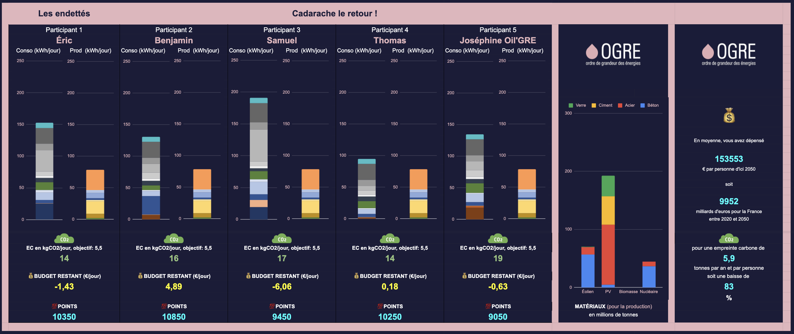

# OGRE

:::tip Digitalisation de l'atelier OGRE

Développement d'une application pour digitaliser et passer à l'échelle l'atelier OGRE, un serious game ludique et collaboratif pour découvrir et comprendre les ordres de grandeur des énergies.

:::

## A propos de OGRE
L’atelier OGRE (Ordre de GRandeur des Énergies) est un serious game ludique et collaboratif pour découvrir et comprendre les ordres de grandeur des énergies.

Qu’est ce que 1 kWh? Peut-on se passer des énergies fossiles? Quel est l’impact d’ajouter des énergies renouvelables sur le réseau? Doit-on aller vers plus de sobriété?
L’atelier OGRE apporte des éléments de réponse à ces questions et aide à s’approprier des termes peu utilisés dans notre quotidien (ex: rendement, facteur de charge, disponibilité,…). L’atelier permet également de voir quelles sont les actions, tant sur la consommation que sur la production, à fort impact énergétique pour évoluer vers un monde plus durable, puis à ouvrir des discussions entre les participants sur le sujet.

Les participants répartis en équipe de 4 à 8 personnes, et aidés par un animateur, disposent de 3h pour équilibrer consommation et production d’énergie décarbonée.

## Le projet 
Aujourd'hui l'atelier est animé avec un outil Google Sheet qui arrive à ses limites pour pouvoir passer à l'échelle tout en rendant l'atelier plus user-friendly. Le but de ce projet est de construire l'application web permettant de digitaliser l'atelier. 

Stack technique:
- Backend Nodejs
- Gestion base de donnée : Postgresql + ORM Sequelize
- Hébergement et déploiement : Heroku + github
- Frontend React

## Compétences recherchées
- Plusieurs développeurs backend Nodejs
- Plusieurs développeurs frontend React
- Gestion de projet : 1 ou plusieurs product owner (largement assez de travail pour 2/3 personnes)
- UX/UI designer

## Références
- [Replay du lancement de la saison 10](https://www.youtube.com/watch?v=bnAXCjD2l80&t=3340s)
- [Replay du Monthly Marty n°1](https://www.youtube.com/watch?v=kSwJopxsphQ&t=1398s)
- Page internet de présentation : https://laconsciencedesetudiants.fr/atelier-ogre/
- La source principale qui a permis de concevoir le moteur de calcul de l'atelier est disponibles à l'[adresse suivante](http://www.inference.org.uk/sustainable/book/translate/french/sewtha_20111001_lowres.pdf)

## Equipe
- Grégory Kotnarovsky, créateur de l'atelier OGRE, grandeur.energies@gmail.com
- Vladimir Nafissi, développeur (bénévole D4G), vlad.nafissi@gmail.com

## Rejoindre le projet
Il suffit de [rejoindre la communauté Data For Good](/join) et de se présenter sur le canal Slack **#10_ogre**

